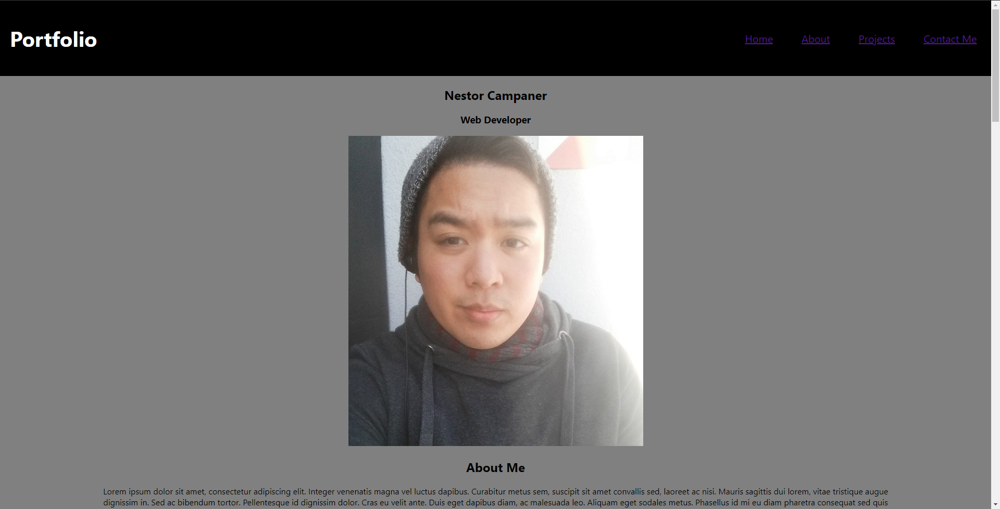
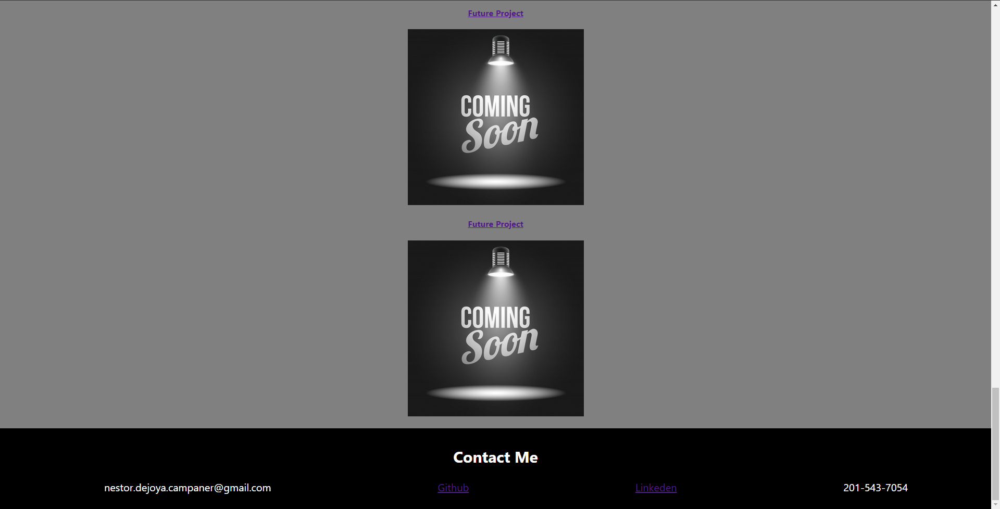

# My_Portfolio

## This is my first portfolio website!

I have currently attempted to use the knowledge I have learn throughout the course to make the website. As the course goes on, I plan on using any new knowledge to continue to update the website. I currently have one project shown and linked to its github page with "coming soon" placeholder imgs for future projects. The nav bar currently links to different parts of the page such as the "home",  "about", "projects', and "contact me".

This initial layout for the page has the information center aligned. I personally feel it looks simple, clean, and straightforward. I plan on to continuously update this page and apply any different skills to make it work and look better.

### [Here is a link to the working website!](https://itsnestor.github.io/My_Portfolio/)