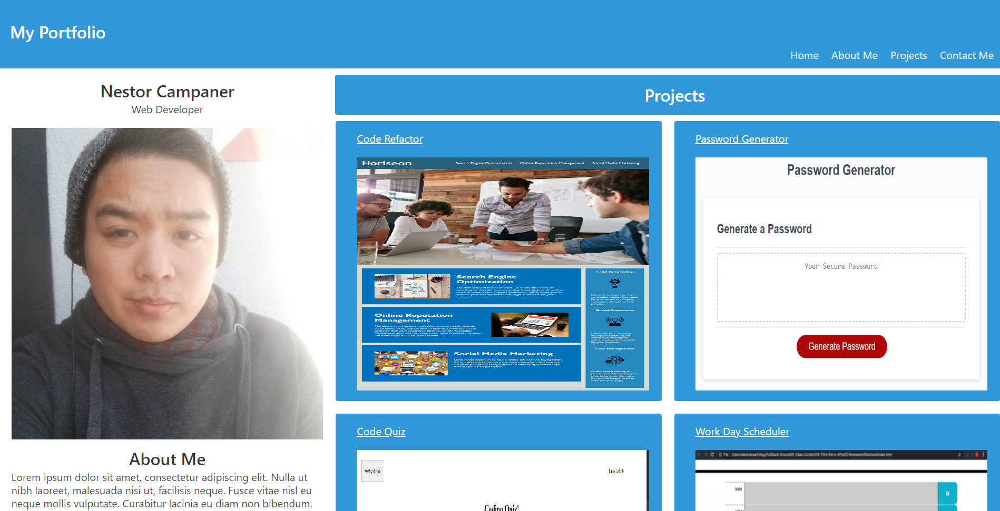
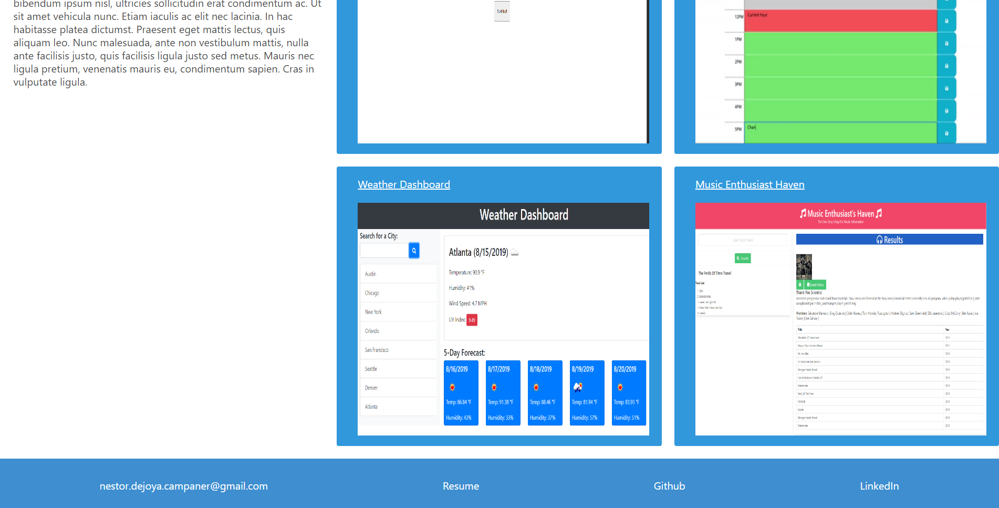

# My_Portfolio

## Description

I have currently attempted to use the knowledge I have learned throughout the course so far to create this website. As the course goes on, I plan on updating the page with any new skills I learn. The page was styled using bulma with some tweaks of my own. The nav bar links to different parts of the page according to its names. At the bottom of the page, I placed a way to contact me through email, my resume, my Github page, and my LinkedIn.

The layout I came up with is having my photo and about me on the left side of the page and the right side of the page would contain the projects I have down so far in the class. The titles of each project link to the github pages associated with it. As I do more projects, I plan on adding them to the page to show off my work.

## Screenshots of Website

## Contact Me
* Email: nestor.dejoya.campaner@gmail.com
* [Github](https://github.com/itsnestor)
* [LinkedIn](https://www.linkedin.com/in/nestor-campaner-136350117/)

### [Here is a link to the working website!](https://itsnestor.github.io/My_Portfolio/)